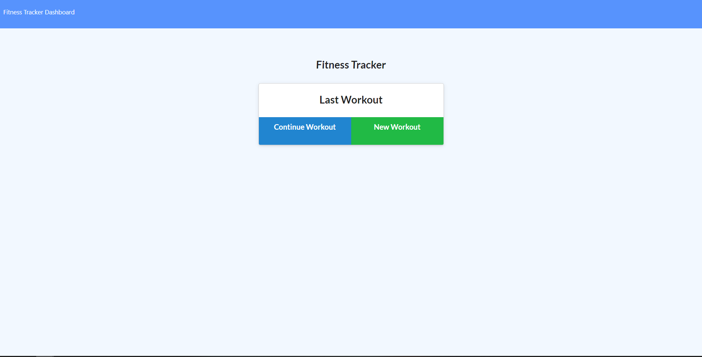

# WorkoutTracker

## Description 

A fully functional fitness tracker application that allows you to track daily cardio and resistance workouts in order to better utilise time. 

## Technologies Used

- HTML
- CSS
- JavaScript
- jQuery
- Bootstrap
- Node.js
- Express.js
- MongoDB
- Mongoose

## Deployed Link

https://workouttrackerdz.herokuapp.com/

## Screenshots

## Contact

email: danielshiaolin@gmail.com
personal portfolio: https://github.com/deezyxp